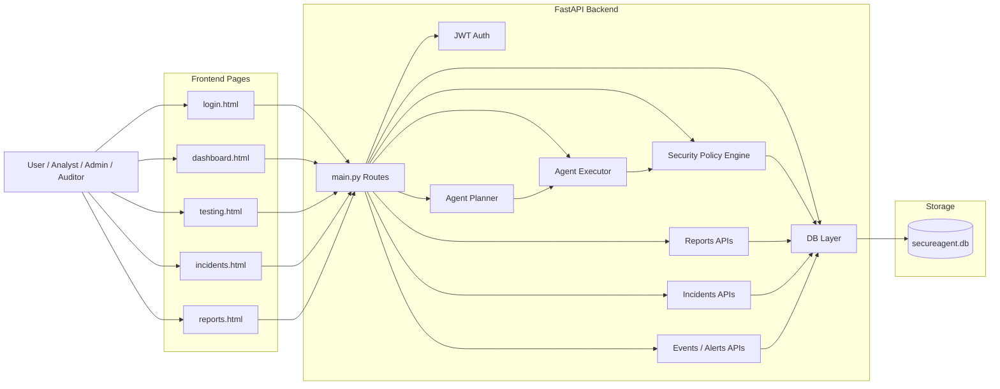
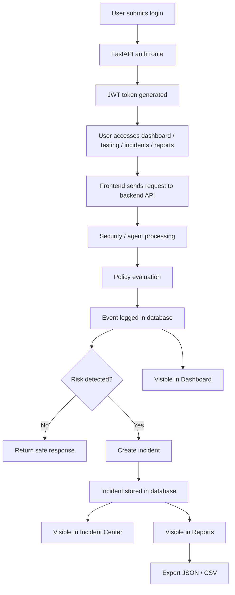

# SecureAgent

Backend-first AI runtime security platform for monitoring, testing, and controlling agent behavior in real time.

SecureAgent is designed to simulate an industry-style security layer for AI systems. It provides runtime event monitoring, role-based access control, incident tracking, report generation, exportable evidence, and a testing lab for manual and automated security evaluation.

---

## Overview

SecureAgent helps demonstrate how an AI security platform can:

- monitor runtime actions of AI agents
- detect suspicious or unsafe behavior
- block malicious operations
- generate incidents for investigation
- provide dashboards and reporting for operators
- enforce role-based access across platform functions

This project is built as a portfolio-grade system focused on **AI runtime security**, **agent governance**, and **security operations style visibility**.

---

## Core Features

### 1. Authentication and Access Control
- Login-based platform access
- JWT token authentication
- Role-aware user handling
- Demo roles included:
  - `admin`
  - `analyst`
  - `auditor`

### 2. Security Dashboard
- Live event visibility
- Blocked vs allowed activity counts
- High-risk event tracking
- Recent runtime event table
- Active alerts panel

### 3. Testing Lab
- Manual agent test execution
- Quick benign and malicious prompt simulation
- Automated red-team test suite
- Result inspection for blocked, allowed, or failed cases

### 4. Incident Center
- Incident listing and filtering
- Incident status tracking
- Role-based incident actions
- Acknowledge and resolve flows

### 5. Reports and Exports
- Security summary reporting
- Severity and role breakdowns
- Application-wise reporting
- Export support for:
  - JSON
  - CSV

### 6. Backend-First Architecture
- FastAPI application structure
- SQLite-backed persistence
- Modular security/event handling
- Platform-oriented route design

---

## Project Structure

```text
secure-agent/
├── .github/
│   └── workflows/
│       └── ci.yml
├── backend/
│   ├── app/
│   │   ├── agent/
│   │   │   ├── __init__.py
│   │   │   ├── executor.py
│   │   │   └── planner.py
│   │   ├── __init__.py
│   │   ├── dashboard.html
│   │   ├── db.py
│   │   ├── incidents.html
│   │   ├── login.html
│   │   ├── main.py
│   │   ├── reports.html
│   │   ├── security.py
│   │   ├── testing.html
│   │   └── tools.py
│   ├── core/
│   ├── models/
│   ├── routes/
│   └── security/
│       ├── __init__.py
│       └── auth.py
├── docker/
├── docs/
├── policies/
│   └── default_policy.yaml
├── tests/
│   ├── red_team_cases.json
│   ├── red_team_results.json
│   ├── run_red_team_cases.py
│   └── test_smoke.py
├── .env.example
├── .gitignore
├── LICENSE
├── README.md
└── secureagent.db
```

---

## Architecture Diagram



---

## Data Flow Diagram



---

## Project Description

SecureAgent is a backend-first AI runtime security platform designed to monitor, test, and control AI agent behavior in real time. It includes authentication, runtime event tracking, alert visibility, incident handling, protected reporting, exportable evidence, and a testing lab for evaluating safe and unsafe agent behavior. The platform is built with FastAPI and demonstrates how security controls can be layered around AI systems in an industry-style workflow.

---

## How the System Works

1. A user logs into the platform using role-based authentication.
2. Frontend pages interact with FastAPI backend routes and APIs.
3. Agent requests are processed through planner, executor, and security checks.
4. Security events are logged to the database.
5. High-risk or unsafe behavior can generate incidents.
6. Operators review data through dashboard, incidents, reports, and testing pages.
7. Reports and evidence can be exported in JSON or CSV format.

---

## Tech Stack

- **Backend**: FastAPI
- **Authentication**: OAuth2 password flow + JWT
- **Database**: SQLite
- **Frontend**: HTML, CSS, JavaScript
- **Server**: Uvicorn
- **CI**: GitHub Actions

---

## Key Pages

| Route | Purpose |
|---|---|
| `/login` | Platform login |
| `/dashboard` | Security dashboard |
| `/testing` | Testing lab |
| `/incidents` | Incident center |
| `/reports` | Reporting and export center |

---

## Key API Routes

### Authentication

```
POST /auth/login
GET  /auth/me
```

### Agent

```
POST /agent/run
```

### Events and Alerts

```
GET  /events
GET  /alerts
GET  /security/stats
POST /security/red-team-test
```

### Incidents

```
GET  /api/incidents
GET  /api/incidents/stats
POST /api/incidents/{incident_id}/ack
POST /api/incidents/{incident_id}/resolve
```

### Reports

```
GET /reports/security-summary
```

### Exports

```
GET /export/events/json
GET /export/incidents/json
GET /export/events/csv
GET /export/incidents/csv
```

---

## Demo Credentials

Use these sample credentials to access the platform:

| Role | Username | Password |
|---|---|---|
| Admin | `admin` | `admin123` |
| Analyst | `analyst` | `analyst123` |
| Auditor | `auditor` | `auditor123` |

---

## How to Run

### 1. Clone the repository

```bash
git clone https://github.com/anshsaxena15112005/secure-agent.git
cd secure-agent
```

### 2. Create and activate virtual environment

**Windows**

```bash
python -m venv .venv
.venv\Scripts\activate
```

### 3. Install dependencies

```bash
pip install -r requirements.txt
```

### 4. Run the server

```bash
uvicorn backend.app.main:app --reload
```

### 5. Open in browser

```
http://127.0.0.1:8000/login
```

---

## Platform Workflow

**Login → Dashboard → Testing / Incidents / Reports**

Typical operator workflow:

1. Sign in to the platform
2. Review runtime events and alerts on the dashboard
3. Run manual or red-team tests in the testing lab
4. Investigate incidents in the incident center
5. Export reports and evidence from the reports page

---

## Why This Project Matters

AI systems need more than just model performance. They also need:

- runtime control
- misuse prevention
- monitoring and observability
- incident handling
- policy enforcement
- operator access control

SecureAgent demonstrates these ideas through a working platform-style implementation.

This project is especially relevant for:

- AI security
- runtime security
- LLM safety systems
- agent governance
- SOC-inspired monitoring platforms
- security-focused backend development

---

## Current Capabilities

- JWT-based login flow
- Role-aware protected actions
- Runtime event collection
- Alert filtering
- Incident workflow
- Report generation
- CSV and JSON export
- Manual test execution
- Automated red-team style testing
- Multi-page platform UI

---

## Future Improvements

- [ ] Real-time websocket updates
- [ ] Richer policy engine
- [ ] Prompt injection classification layer
- [ ] Anomaly detection scoring
- [ ] PostgreSQL support
- [ ] Docker Compose deployment
- [ ] Chart-based analytics
- [ ] Audit timeline views
- [ ] User management panel
- [ ] Multi-tenant application support

---

## Screenshots

> Add screenshots here after UI polish.

**Example:**

- Login Page
- Security Dashboard
- Incident Center
- Reports Page
- Testing Lab

---

## Resume / CV Ready Summary

SecureAgent is an AI runtime security platform built with FastAPI that provides real-time monitoring, security event analysis, incident management, protected reporting, role-based access control, and a testing lab for evaluating unsafe agent behavior.

---

## Author

**Ansh Saxena**

GitHub: [anshsaxena15112005](https://github.com/anshsaxena15112005)

---

## License

This project is for learning, demonstration, and portfolio purposes.
